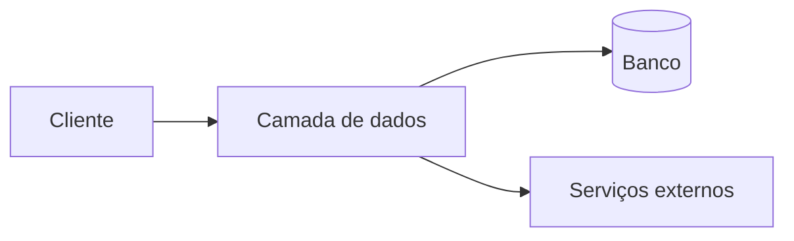

# {{NOME DO SISTEMA}}

> Documento mestre do projeto. **Leia antes de desenvolver. Atualize depois de alterar.**
> Em caso de divergência entre este documento e uma solicitação, o conflito deve ser levantado antes de codificar.

| | |
| --- | --- |
| **O que é** | {{uma frase}} |
| **Versão** | {{ano.mes.sequencia}} |
| **Última atualização** | {{AAAA-MM-DD}} |
| **Aplicação** | {{caminho da app no repositório}} |

---

## 1. Visão de negócio

### 1.1 Problema

{{o que estava ruim antes do sistema existir}}

### 1.2 Perfis de usuário

| Perfil | O que faz | O que espera |
| --- | --- | --- |
| | | |

### 1.3 Jornada principal

1. {{passo}}

### 1.4 Regras de negócio

| ID | Regra | Onde é aplicada | Violação |
| --- | --- | --- | --- |
| RN-01 | | | |

### 1.5 Fora de escopo

- {{o que o sistema deliberadamente não faz}}

### 1.6 Métricas

| Métrica | Como é medida |
| --- | --- |
| | |

---

## 2. Arquitetura

### 2.1 Stack

| Camada | Tecnologia | Versão |
| --- | --- | --- |
| | | |

### 2.2 Fluxo



### 2.3 Estrutura de pastas

```text
{{só o que importa, com comentário}}
```

### 2.4 Onde o código roda

| Código | Ambiente | Motivo |
| --- | --- | --- |
| | | |

### 2.5 Variáveis de ambiente

| Variável | Onde vive | Para que serve | Pública |
| --- | --- | --- | --- |
| | | | |

> Nenhum valor de credencial é registrado neste documento.

### 2.6 Build e execução

| Comando | O que faz |
| --- | --- |
| | |

---

## 3. Banco de dados

### 3.1 Modelo

```mermaid
erDiagram
```

### 3.2 Tabelas

#### `{{schema.tabela}}`

{{propósito em uma linha}}

| Coluna | Tipo | Nulo | Default | Significado |
| --- | --- | --- | --- | --- |
| | | | | |

- **Chaves:** {{PK, FK}}
- **Índices:** {{nome — colunas — motivo}}
- **Constraints:** {{nome — regra}}
- **Triggers:** {{nome — quando — o que faz}}

### 3.3 Views

| View | O que expõe | O que esconde de propósito |
| --- | --- | --- |
| | | |

### 3.4 Funções

| Função | Security definer | Para que serve | Quem executa |
| --- | --- | --- | --- |
| | | | |

### 3.5 RLS

| Tabela | Política | Operação | Papel | Condição | Intenção |
| --- | --- | --- | --- | --- | --- |
| | | | | | |

### 3.6 Storage

| Bucket | Público | Leitura | Escrita |
| --- | --- | --- | --- |
| | | | |

### 3.7 Realtime

- {{tabelas publicadas}}

### 3.8 Convenções

- {{padrão de nome, timestamps, tipo de PK}}

### 3.9 Migrações

| Arquivo | O que introduziu |
| --- | --- |
| | |

### 3.10 Regra de migração

Toda migração é **aditiva**. Nenhum registro existente é apagado ou alterado. Mudança estrutural entra como migração nova, executada no Supabase, e salva em `supabase/sql/{{incremental}}`.

---

## 4. Layout e experiência

### 4.1 Tokens

| Token | Claro | Escuro | Uso |
| --- | --- | --- | --- |
| | | | |

Tipografia, espaçamento, raio, sombra e transição: {{variáveis reais}}

### 4.2 Estrutura visual

{{shell, navegação, conteúdo, largura máxima, responsividade}}

### 4.3 Padrões de componente

| Componente | Arquivo | Quando usar |
| --- | --- | --- |
| | | |

### 4.4 Estados obrigatórios de tela

| Estado | Tratamento |
| --- | --- |
| Carregando | {{overlay bloqueante animado, frase variável}} |
| Vazio | {{tela amigável com botão de novo registro}} |
| Erro | |
| Sucesso | |
| Sem permissão | {{módulo oculto}} |

### 4.5 Comportamentos exigidos

- Atualização em tempo real, silenciosa, sem refresh.
- Ação crítica confirmada por modal com ícone animado, mensagem explicativa e sim/não.
- Versão visível no rodapé, no formato `ano.mes.sequencia`.

### 4.6 Acessibilidade

- {{contraste, foco visível, teclado, rótulos}}

### 4.7 Idioma e formatos

- {{pt-BR, moeda, data, telefone}}

---

## 5. Segurança e permissões

### 5.1 Autenticação

{{onde a sessão nasce, onde é guardada, como expira}}

### 5.2 Papéis

| Papel | Alcance |
| --- | --- |
| | |

### 5.3 Matriz de permissão

| Módulo | Ver | Criar | Editar | Excluir |
| --- | --- | --- | --- | --- |
| | | | | |

### 5.4 Camadas de proteção

O front **esconde**, o banco **impede**. Rota protegida sem RLS equivalente é falha.

| Recurso | Proteção no front | Proteção no banco |
| --- | --- | --- |
| | | |

### 5.5 Segredos

| Segredo | Onde vive | Quem consome |
| --- | --- | --- |
| | | |

Chamada a serviço externo que usa segredo passa por {{proxy no servidor}}. Nunca sai do browser.

### 5.6 Validação de entrada

| Limite do sistema | O que é validado |
| --- | --- |
| | |

### 5.7 Uploads

{{tipos, tamanho, destino}}

### 5.8 Riscos conhecidos

| Risco | Mitigação | Status |
| --- | --- | --- |
| | | |

---

## 6. Módulos

### 6.x {{Nome do módulo}}

| | |
| --- | --- |
| **Rota** | |
| **Arquivos** | |
| **Permissão** | |
| **Tabelas** | |
| **Regras** | |
| **Integrações** | |

{{o que o usuário faz, estados e validações da tela}}

---

## 7. Integrações externas

### 7.x {{Serviço}}

| | |
| --- | --- |
| **Para que serve** | |
| **Versão da API** | |
| **Credencial** | {{nome da variável e onde vive}} |
| **Caminho da chamada** | |
| **Endpoints** | |
| **Erros e limites** | |

---

## 8. Convenções de código

- {{nomenclatura, organização, acesso a dados, erro, tipagem, comentário, commit}}

---

## 9. Roadmap

> Ainda **não** implementado.

| Item | Descrição | Prioridade |
| --- | --- | --- |
| | | |

---

## 10. Changelog

| Versão | Data | O que mudou | Arquivos e migrações |
| --- | --- | --- | --- |
| | | | |

---

## 11. Pendências

- [ ] ⚠️ {{pergunta a confirmar com o dono do projeto}}
