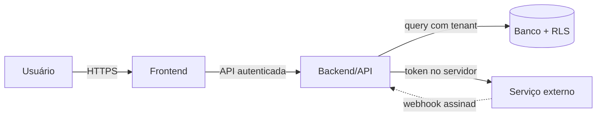

# Threat Model — [funcionalidade]

> `AAAA-MM-DD` · Versão do modelo: 1
> Autor: JH7-MESTRE-SEGURANÇA

---

## 1. O que estamos construindo

Descrição funcional em 3 a 5 linhas. O que entra, o que sai, o que é gravado.

### Fluxo de dados

### Fronteiras de confiança

| Fronteira | O que muda de confiança |
| --- | --- |
| Navegador → API | tudo que vem do cliente é não confiável |
| API → Banco | privilégio da credencial da aplicação |
| Tenant A → Tenant B | isolamento obrigatório |
| Usuário → Admin | escalonamento a impedir |
| Serviço externo → API | resposta e webhook não confiáveis |

---

## 2. Ativos

| Ativo | Sensibilidade | Impacto se vazar/alterar |
| --- | --- | --- |
| | | |

---

## 3. Atores

| Ator | Deve poder | Não deve poder |
| --- | --- | --- |
| Anônimo | | |
| Usuário autenticado | | |
| Usuário de outro tenant | nada | tudo |
| Admin do tenant | | |
| Super admin | | |
| Integração externa | | |
| Bot / automação | | |

---

## 4. Ameaças (STRIDE)

| ID | Ameaça | STRIDE | Impacto | Probab. | Risco | Mitigação | Status |
| --- | --- | --- | --- | --- | --- | --- | --- |
| T-01 | | S/T/R/I/D/E | Alto | Média | Alto | | implementada / planejada / aceita |
| T-02 | | | | | | | |

---

## 5. Perguntas de abuso respondidas

| Pergunta | Resposta / mitigação |
| --- | --- |
| Como alguém abusaria disso? | |
| Como acessaria dado de outro usuário? | |
| Como acessaria dado de outra empresa? | |
| Como escalaria privilégio? | |
| Como automatizaria o abuso? | |
| Como manipularia a requisição? | |
| Como contornaria o frontend? | |
| Como exploraria os IDs? Dá para enumerar? | |
| Como causaria indisponibilidade ou custo? | |
| Como extrairia dados em massa? | |
| O que acontece com 1.000 requisições repetidas? | |
| O que acontece com dois pedidos simultâneos? | |

---

## 6. Decisões de segurança

| Decisão | Alternativa descartada | Motivo |
| --- | --- | --- |
| | | |

### Risco residual aceito

| Risco | Por que foi aceito | O que reduziria | Reavaliar quando |
| --- | --- | --- | --- |
| | | | |

---

## 7. Validação

Como sabemos que as mitigações funcionam:

- [ ] teste automatizado: usuário A não acessa recurso de B
- [ ] teste automatizado: empresa A não acessa recurso de B
- [ ] teste de autorização por papel
- [ ] teste de validação de entrada (campo sensível rejeitado)
- [ ] teste de rate limit
- [ ] verificação manual documentada: `[o quê, como]`
- [ ] alerta/monitor criado para a ameaça `T-xx`

---

## 8. Quando revisar este modelo

- mudança em autenticação, autorização ou multi-tenancy
- nova integração ou nova entrada de dado externo
- exposição pública de algo interno
- incidente relacionado
